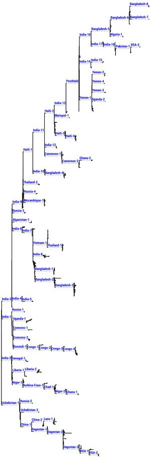
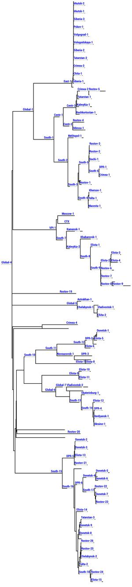
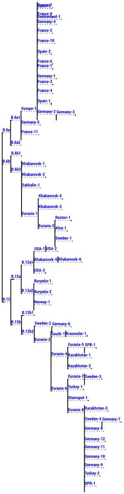
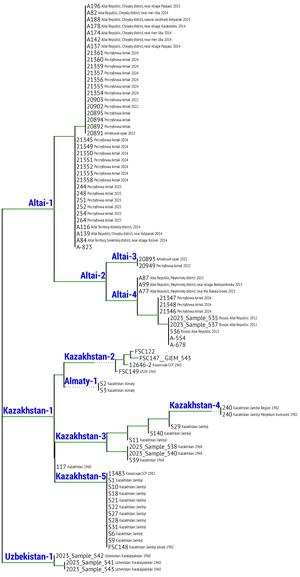

# SNP Genotyper

Программа для определения генетических линий токсигенных и нетоксигенных штаммов Vibrio cholerae, Francisella tularensis subsp. mediasiatica и Francisella tularensis subsp. holarctica на основе данных полногеномного секвенирования

## Содержание

- [Алгоритм](#алгоритм)
- [Поддерживаемые микроорганизмы](#поддерживаемые-микроорганизмы)
- [Запуск](#запуск)
- [Входные данные](#входные-данные)
- [Работа в режиме графического интерфейса](#работа-в-режиме-графического-интерфейса)
- [Трактовка результатов](#трактовка-результатов)
- [Запуск в консольном режиме](#запуск-в-консольном-режиме)
- [Обратная связь](#обратная-связь)
- [Описание генетических линий](#описание-генетических-линий)

## Алгоритм

Программа «SNP Genotyper» предназначена для быстрого анализа данных полногеномного секвенирования с целью определения генетической линии исследуемых штаммов. Определение генетической линии проводится на основе заложенных в программу ранее выявленных маркерных SNP (единичных нуклеотидных замен), характерных для каждой из линий.

Для определения линии достаточно выявление хотя бы 50% от SNP, характерных для генетической линии.

## Поддерживаемые микроорганизмы

Текущая версия программы позволяет проводить анализ данных полногеномного секвенирования следующих видов:

- **Vibrio cholerae** (токсигенные и нетоксигенные штаммы)
- **Francisella tularensis subsp. mediasiatica**
- **Francisella tularensis subsp. holarctica**

## Запуск

Программа «SNP Genotyper» является кроссплатформенной и предназначена для работы в операционных системах Windows, Linux и MacOS. Предусмотрен как графический интерфейс для пакетного режима работы с выводом результатов в общей таблице, так и консольный вариант запуска из командной строки.

Программа доступна в двух вариантах:

- **Только исполняемый jar-файл**, предназначенный для работы в среде Windows, Linux и MacOS. Требуется предварительная установка Java Runtime Environment (JRE).
- **Полная версия с встроенной JRE**. (.7z архив) Предназначена для работы в среде Windows без необходимости установки дополнительных программ.

### Установка

Для запуска программы достаточно распаковать скачанный архив с программой и запустить файл `SNPGenotyper.bat` (.7z архив) или `SNPGenotyper.jar`.

## Входные данные

В качестве исходных данных используется файл в fasta-формате, содержащий набор контигов, полученных в результате полногеномного секвенирования)

Предпочтительное расширение файла: `.fasta` или `.fa`.

Возможна пакетная обработка множества fasta-файлов (каждый файл содержит геном одного штамма).

## Работа в режиме графического интерфейса

При запуске программы открывается графический интерфейс. Для работы необходимо:

1. Заполнить поле **«Title»** - эти данные будут использованы в качестве имени файла с результатом
2. Нажать кнопку **«Start»** - откроется стандартное диалоговое окно выбора исходного файла (файлов) для анализа
3. После выбора файлов анализ начинается автоматически

### Индикация прогресса

В процессе работы внизу окна программы:
- Тонкая бегущая полоса отображает прогресс анализа текущего файла
- Широкая бегущая полоса отображает общий прогресс анализа (при анализе нескольких геномов)

**Ориентировочное время работы**: от 1 до 5 минут для каждого штамма (fasta-файла).

## Трактовка результатов

Определение генетических линий проводится согласно канонической дендрограмме, отражающей генетическую близость между различными штаммами.

### Формат результатов

В процессе работы получаемые данные отображаются в окне результата. После завершения работы программы результат сохраняется в текстовом файле, расположенном в папке с исходными fasta-файлами.

При копировании этого файла в текстовый редактор (или MS Excel, LibreOffice Calc) данные отображаются в табличной форме. Пример для штаммов Vibrio cholerae:

| Strain | Lineage | All Lineages |
|--------|---------|--------------|
| RND18826 | Russia-4 | India-3, India-9, Russia-4 |
| RND19187 | India-12 | India-3, India-9, Haiti-1, India-11, India-12 |
| RND6878 | PostHaiti | India-3, India-9, Haiti-1, India-11, Haiti-2, India-13, PostHaiti |

Для каждого изучаемого генома выводится:
- **Strain** - название образца
- **Lineage** - итоговая генетическая линия
- **All Lineages** - все родительские линии

## Запуск в консольном режиме

Для запуска в консольном режиме на компьютере должен быть установлен пакет Java или аналог.

### Команда запуска:

```bash
java -jar SNPGenotype.jar -i <genome.fasta> -r <result file>
```

где:
- `genome.fasta` – анализируемый геном в формате fasta.
- `result file` – файл, в который будут выведены результаты анализа в json-формате

## Обратная связь

**Авторы:** Водопьянов А.С., Водопьянов С.О., Писанов Р.В.

**Контактная информация:**
- Email: alexvod@gmail.com
- Телефон: 8(863)240-22-66
- Почтовый адрес: 344002, г. Ростов-на-Дону, ул. М. Горького, 117/40, Водопьянову Алексею Сергеевичу

Все пожелания, замечания и выявленные ошибки можно направлять по указанным контактам.

---

**Учреждение-разработчик:**  
ФКУЗ Ростовский-на-Дону противочумный институт Роспотребнадзора

**Область применения:**  
Методические рекомендации предназначены для специалистов, занимающихся молекулярно-генетическим анализом штаммов холерного вибриона и франциселл туляремии.

## Описание генетических линий

### Vibrio cholerae ctxB+

Для токсигенных (ctxB+) штаммов *Vibrio cholerae* седьмой пандемии выделено 78 различных генетических линий на основе сравнительного филогенетического анализа.

<div align="left">
<a href="img/Tree_Vch_CTX.jpg" target="_blank">
  
</a>
</div>

### Vibrio cholerae ctxB-

Для нетоксигенных (ctxB-) штаммов *Vibrio cholerae* выделено 115 различных генетических линий на основе сравнительного филогенетического анализа.

<div align="left">
<a href="img/Tree_Vch.jpg" target="_blank">
  
</a>
</div>

### Francisella tularensis subsp. holarctica

Для штаммов *Francisella tularensis subsp. holarctica* выделено 76 различных генетических линий на основе сравнительного филогенетического анализа.

<div align="left">
<a href="img/Tree_F.tul.hol.jpg" target="_blank">
  
</a>
</div>

### Francisella tularensis subsp. mediasiatica

Для штаммов *Francisella tularensis subsp. mediasiatica* выделено 11 различных генетических линий на основе сравнительного филогенетического анализа.
<div align="left">
<a href="img/Tree_F.tul.med.jpg" target="_blank">
  
</a>
</div>